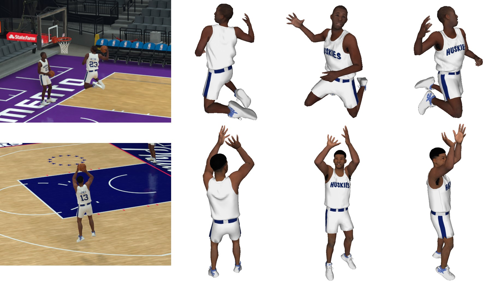

# NBA2K Dataset [[Project Page]](http://grail.cs.washington.edu/projects/nba_players/)
<div align=center>

</div>

## Overview
This repository maintains the NBA2K dataset of our ECCV 2020 paper 'Reconstructing NBA Players'. We collect RGB images, triangle meshes with UV coordinates, texture maps, 3D human poses and camera projection matrix from the NBA2K19 game engine. Our dataset has large diversity in basketball poses and provides industry-level clothed basketball player meshes. 

## Dataset Content
### The data is captured in three modes: 
- 2ku: Captured under 2KU freestyle mode. Only 1 player is available in the frame. This type of data is mainly used to get fancy dribbling, lay-up, dunking and shooting pose.
- normal: Captured under quick play mode. At most 10 players are in the frame. This type of data has occlusion and various poses in a normal basketball game.
- rest pose: Captured under player editing mode. 1 capture per player in the standing pose.
### images.zip
- `/release/${player_name}/${capture_mode}/${capture_name}.png`: RGB images of frame captures.
### pose.zip 
- `/release/${player_name}/${capture_mode}/${capture_name}/players/${person_id}_person_v2_transform_v2.npy`: 3D bone transformation of players.
- `/release/${player_name}/${capture_mode}/${capture_name}/proj_mat.npy`: 4x4 camera projection matrix.
- `rest_pose_data/`: `0_person_no_dup.obj` stores A-pose coarse mesh. `0_person_no_dup_blend.npy` stores bone id matrix for A-pose coarse mesh, used for Linear Blend Skinning. `aug_joints_v2.obj` stores A-pose 3D joints.` aug_joints_v2.npy` stores bone id matrix for A-pose 3D joints. `aug_joints_v2_id.txt` stores the joint definition.
### mesh.zip
- `release/${player_name}/${capture_mode}/${capture_name}/player_parts/`: Raw triangle meshes of different body parts for all players in current frame.
- `release/${player_name}/${capture_mode}/${capture_name}/players/`: `${person_id}_person.obj` stores the full body mesh (including hair, tooth, beard, mane, eye etc.) of all players in current frame. `${person_id}_person_simple.obj` stores the simplified full body mesh (only has shirt, pant, leg, arm, head, shoes) of all players in current frame. These meshes are not registered and have different mesh topologies.
- `release/${player_name}/resampled/${capture_mode}/${capture_name}/player_parts/`: Registered triangle meshes of different body parts for all players in current frame. Only has shirt, pant, leg, arm, head, shoes. 
- `release/${player_name}/resampled/${capture_mode}/${capture_name}/players/`: Registered simplified full body meshes for all players in current frame. Only has shirt, pant, leg, arm, head, shoes. The mesh topology is same across all data examples and can be used for deep network training.
- `release/${player_name}/textures`: Texture maps of the current player.  To make sure the mtl file can find the texture images, you need to copy the textures folder under the ${capture_mode} sub directory. Otherwise, you will encounter texture not found error when you visualize the obj file in Meshlab.
- `seg_release/seg_${player_name}_${capture_mode}.txt`: Body segmentation file. It indicates which body part belongs to which player.
### mesh_release.zip
Processed data used to train the mesh generation networks.
- `template/objs/`: Rest pose mesh for all players in obj format.
- `template/template.pkl`: A dictionary with key=player_name and value=vertices of the rest pose mesh.
- `release/${player_name}/images`: Center cropped 256x256 images for target players.
- `release/${player_name}/release_${player_name}_${capture_mode}.pkl`: Meta data dictionary with following keys:
    - head_verts: List of head vertices of all examples for player_name under capture_mode.
    - arm_verts: List of arm vertices of all examples for player_name under capture_mode.
    - shirt_verts: List of shirt vertices of all examples for player_name under capture_mode.
    - pant_verts: List of pant vertices of all examples for player_name under capture_mode.
    - leg_verts: List of leg vertices of all examples for player_name under capture_mode.
    - shoes_verts: List of shoes vertices of all examples for player_name under capture_mode.
    - human_verts: List of human vertices of all examples for player_name under capture_mode.
    - j3d: List of 3D joints position of all examples for player_name under capture_mode.
    - player: List of player name of all examples for player_name under capture_mode.
    - dir_type: List of capture mode of all examples for player_name under capture_mode.
    - nba_dir: List of capture name of all examples for player_name under capture_mode.
    - person_id: List of person id of all examples for player_name under capture_mode.
- The meshes and 3D joints are translated and rotated so that pelvis is located at the world origin and players are facing towards x positive axis. Please see prepare_data.py for the details of the data processing.
### j3d_regressor.npy
Matrix mapping from vertices position to joints position.

## Data Processing
You can directly use the training data in mesh_release.zip. We also provide scripts for processing the raw data. Here are the necessary steps to run the script:
- Install dependences: numpy and opencv-python
- Make sure you have more than 100GB disk space. Download images.zip, pose.zip and mesh.zip to your DATA_ROOT_FOLDER, then unzip the file, for example `unzip images.zip -d images`.
- Clone this repo to your DATA_ROOT_FOLDER, set the `root_folder` in prepare_data.py to your DATA_ROOT_FOLDER, then run `python prepare_data.py`.

## Requesting the Dataset
Please fill in the [Google form](https://forms.gle/xp1EMji4Hv6HccT49) to request the dataset.

## Important Notes
As we said in the paper, we are not allowed to release the data of current NBA players due to copyright issues. Instead, we additionally collected the same kind of data for 28 synthetic players. The original data are captured from real NBA players under Lakers' 2018-19 Home/Away uniforms and Nike LeBron 16 shoes. The released data are captured from 2K-made synthetic players under Raptors' 1946-47 Home uniforms and 2K brand shoes. The number of vertices and faces (V_num, F_num) for original data and released data are as follows:
- arm: original (842, 1636), released (842, 1636).
- shirt original (2098, 4026), released (2100, 4028).
- pant: original (1439, 2748), released (168, 294).
- head: original (348, 646), released (348, 646).
- leg: original (372, 704), released (372, 704).
- shoes: original (937, 1816), released (885, 1752).

## Acknowledgement
We thank [Visual Concepts](https://vcentertainment.com/) for allowing us to capture, process, and share our extracted NBA2K data for research.

## License
The dataset is made available under [Creative Commons BY-NC-SA 4.0](https://creativecommons.org/licenses/by-nc-sa/4.0/) license by University of Washington. You can **use, redistribute, and adapt it for non-commercial purposes**, as long as you (a) give appropriate credit by **citing our paper**, (b) **indicate any changes** that you've made, and (c) distribute any derivative works **under the same license**.

## Citation
If you use our dataset, please citing our [work](https://arxiv.org/pdf/2007.13303.pdf).

```latex
@InProceedings{zhu_2020_eccv_nba,
    author={Zhu, Luyang and Rematas, Konstantinos and Curless, Brian and Seitz, Steve and Kemelmacher-Shlizerman, Ira},
    title={Reconstructing NBA players},
    booktitle = {Proceedings of the European Conference on Computer Vision (ECCV)},
    month = {August},
    year={2020}
}
```